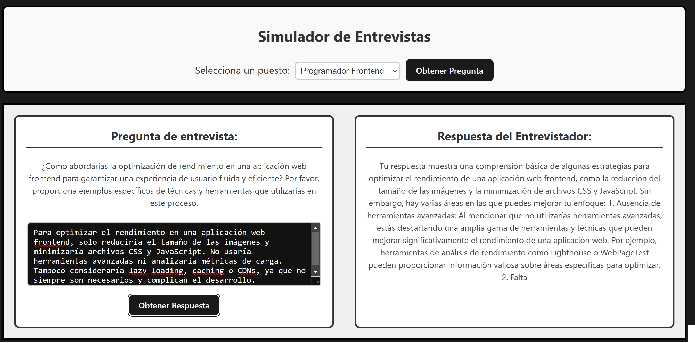
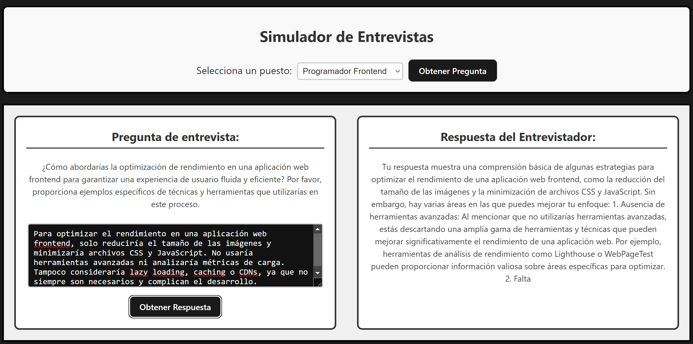

# Simulador de Entrevistas

Este proyecto es una aplicación web que simula entrevistas de trabajo. La aplicación utiliza la API de OpenAI (ChatGPT) para generar preguntas de entrevista y proporcionar retroalimentación sobre las respuestas del usuario, simulando el comportamiento de un entrevistador profesional.

---

## Descripción del Funcionamiento

La aplicación se estructura en varios componentes de React y un módulo para conectarse a la API de OpenAI:

- **Conectividad_ChatGPT_API.js**  
  Este módulo se encarga de comunicarse con la API de OpenAI utilizando la clave almacenada en las variables de entorno. La función `obtenerDatos` crea un *prompt* personalizado dependiendo del flujo:
  - Si se solicita feedback (cuando `respuestaChatgpt` es `true`), el *prompt* solicita un análisis crítico y constructivo de la respuesta del usuario.
  - Si no se solicita feedback, el *prompt* pide generar una pregunta de entrevista representativa para el puesto seleccionado.
  
  La función retorna una promesa que, al resolverse, entrega la respuesta procesada por GPT-3.5 Turbo.

- **Componentes React**  
  - **SeleccionarPuesto.jsx**: Permite al usuario elegir un puesto (por ejemplo, Programador Backend, Frontend o Full Stack) y desencadena la generación de una pregunta.
  - **Pregunta.jsx**: Muestra la pregunta generada y un área de texto para que el usuario ingrese su respuesta.
  - **Respuesta.jsx**: Muestra la respuesta del “entrevistador” (la retroalimentación o la nueva pregunta generada por ChatGPT).
  - **SimuladorEntrevista.jsx**: Es el componente principal que gestiona el estado de la aplicación (puesto, respuesta del usuario, pregunta generada, respuesta del entrevistador y posibles errores). Controla los eventos de selección y respuesta, realizando llamadas a la API de OpenAI mediante la función `obtenerDatos`.
  - **App.jsx**: El punto de entrada que renderiza el componente principal `SimuladorEntrevista`.

La comunicación con la API se efectúa en tiempo real cada vez que el usuario solicita una pregunta o envía una respuesta, lo que permite simular un entorno de entrevista interactivo.

---

## Instalación y Uso

1. **Requisitos Previos**  
   - Node.js y npm instalados.
   - Una cuenta en OpenAI y una API Key.  
   
2. **Configuración del Proyecto**  
   - Clona el repositorio.
   - Instala las dependencias con:
     ```bash
     npm install
     ```
   - Crea un archivo `.env` en la raíz del proyecto y añade tu API key:
     ```env
     VITE_OPENAI_API_KEY=tu_clave_api_aqui
     ```
     
3. **Ejecución**  
   - Inicia la aplicación:
     ```bash
     npm run dev
     ```
   - Abre el navegador en la dirección indicada (por ejemplo, `http://localhost:3000`) para utilizar el simulador.

---

## Ejemplos de Respuestas

A continuación, se muestran ejemplos visuales para identificar una **respuesta buena** y una **respuesta mala**:

### Ejemplo de Respuesta Buena

> *La respuesta buena presenta claridad, estructura y demuestra un análisis profundo, resaltando tanto fortalezas como áreas de mejora de manera constructiva.*

### Ejemplo de Respuesta Mala

> *La respuesta mala carece de detalles, es vaga y no ofrece una retroalimentación constructiva, limitándose a comentarios genéricos.*

---

## Conclusión

Este simulador de entrevistas es una herramienta interactiva que te permite practicar para entrevistas reales, recibiendo feedback o nuevas preguntas de forma automatizada a través de la inteligencia artificial. La aplicación es escalable y personalizable, permitiendo ajustes en los *prompts* y la lógica de negocio según las necesidades del usuario.

¡Esperamos que encuentres útil esta herramienta para mejorar tus habilidades en entrevistas!

---
